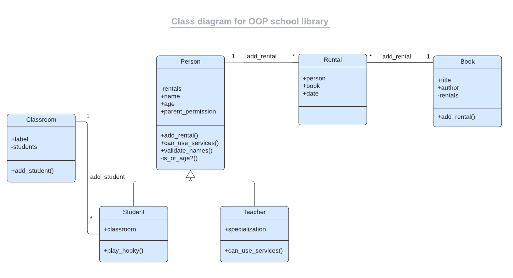

# OOP school library

> Imagine that you are the librarian of OOP University, and you need a tool to record what books are in the library and who borrows them.   The app that you will create will allow you to:

 - Add new students or teachers.
 - Add new books.
 - Save records of who borrowed a given book and when.
 And all of this will be built in a beautiful and well-organized way!

### How to build the "OOP school library" app

Started  by building the most essential pieces of the system. To do that, you will practice Object Oriented Programming. To build the app or system you will need to create the entities presented in this diagram. Spoiler alert: this is a UML class diagram that you did not get to know yet  - it is a topic from upcoming lessons. However, it can give you an overall idea of what you are going to build.

  

## Built With

- Ruby

## Getting Started

To get a local copy up and running follow these simple example steps:

1- Click on the top right green **`code`** button. 
2- On the dropdown menu, choose the **`download zip`** button. 
3- After download, extract the zip file and you have the project running on your machine. 
4- You can also clone the project using the **`git clone  https://github.com/isaacpitwa/oop-school-library-.git`** command. 
5- Enter in to the folder `cd oop-school-library-`
6- Open the folder with a code editor (VS Code preferred)
7- Run in the terminal `ruby student.rb`

## Author

:bust_in_silhouette: **Isaac Pitwa**

- GitHub: [@isaacpitwa](https://github.com/isaacpitwa)
- Twitter: [@isaacpitwa](https://twitter.com/isaacpitwa)
- LinkedIn: [LinkedIn](https://linkedin.com/in/isaac-pitwa)

## :handshake: Contributing

Contributions, issues, and feature requests are welcome!

Feel free to check the [issues page](../../issues/).

## Show your support

Give a :star:️ if you like this project!

## Acknowledgments

- Hat tip to anyone whose code was used
- Inspiration
- etc

## :memo: License

This project is [MIT](./MIT.md) licensed.